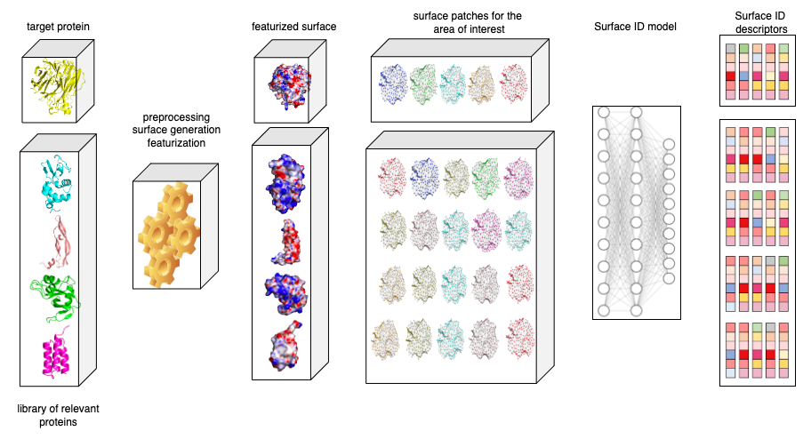

# Surface Similarity Search via Geometric Deep Learning: SurfaceID



A protein can be represented in several forms, including its 1D sequence, 3D atom coordinates, and molecular surface. A protein surface contains rich structural and chemical features directly related to the protein’s function such as its ability to interact with other molecules. While many methods have been developed for comparing similarity of proteins using the sequence and structural representations, computational methods based on molecular surface representation are limited. Here, we describe “Surface ID”, a geometric deep learning system for high-throughput surface comparison based on geometric and chemical features.  Surface ID offers a novel grouping and alignment algorithm useful for clustering proteins by function, visualization, and in-silico screening of potential binding partners to a target molecule. Our method demonstrates top performance in surface similarity assessment, indicating great potential for protein functional annotation, a major need in protein engineering and therapeutic design.


## Setup
### requirements. 
Assuming that MaSIF and its packages are installed, or the surface npz files are provided, surface ID requirements can be installed with:

```bash
pip install -r requirements.txt
```
plyfile package needs to be installed for reading/writing the surface mesh.


## Data
### Preprocessing 
MaSIF publication's original pipeline is used (with modification)
for generating a surface representation per molecule.

For each molecule, use src/masif2npz.py to generate surface representation files. These files are "collated" into a  `{id}_{chain}_suface.npz` that contains the features that SurfaceID requires.

## Running SurfaceID
Following the MaSIF preprocessing and generation npz/*.npz, provide the library(test/inputs.csv) and config parameters under test/config.yml.

```bash
python main.py
```

Important config parameters:
* Target : target protein (if empty, an all-against-all search will be conducted)
* CONTACT : whether the PPI interface of the complex system should be used for search
* RESTRICT: if contact interface is not specified , this keyword tells SurfaceID to read the XYZ coordinates of the area of interest for each library. The entire protein surface can be searched when when as region column exists in the inputs/input.csv where keywords F,C,R stands for entire protein surface, PPI area, or , restricted (with XYZ coordinates), respectively.
* SPATIAL_PARAMETERS: are various distance and size parameters used to define the search area or size of the hit region

## Visualization of the SurfaceID search outputs.
Following the installation of the PyMOL plugin from MaSIF, SurfaceID plugin can be installed to visualize the search/align results
A copy of the modified MaSIF plugin where the surfaces for target/candidate hits can be visualized is available under src/pymol_plugin.
upon installing this plugin, sidloadply and sidloadply_ref are added to the CMD list. If not, you may need to append the path to this script to ~/.pymolpluginsrc.py (pymol.plugins.set_startup_path).
If the SurfaceID search is conducted and the "ALIGNED & SAVEPLY" are set to "TRUE" in the config.yml file, the hit surface area on target and candidate proteins can be visualized with these commands in the PyMOL terminal:
``` python
# aligned candidate hit
sidloadply <candidate.target.ply>

# target surface area corresponding to each candidate hits identified by:
# all for all candidate hits
#[1,2,3] for candidate hits 1, 2, 3
#(1,10) for candidate hits 1, 2, 3,...,10
# 1 for the first candidate hit

sidloadplyref <target_ref.ply> , all
```
# Reference

Please cite the following work:

```
S Riahi, J Hyeon Lee, T Sorenson, S Wei1, S Jager, R Olfati-Saber, A Park, M Wendt, H Minoux, Y Qiu;
Surface ID: A Geometry-aware System for Protein Molecular Surface Comparison;
Bioinformatics, Volume 39, Issue 42023,btad196, 2023
```
